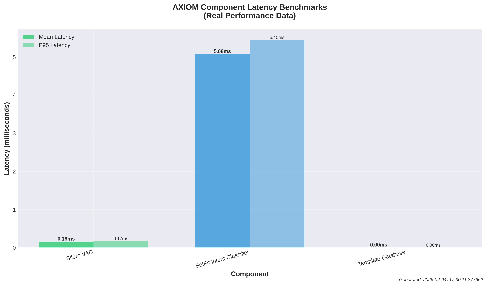
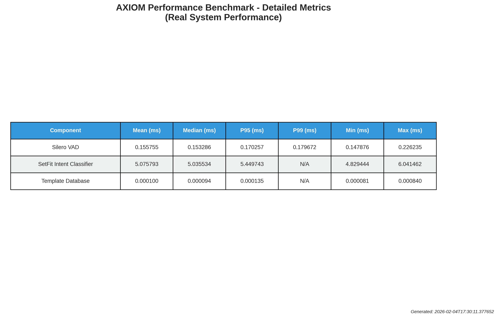
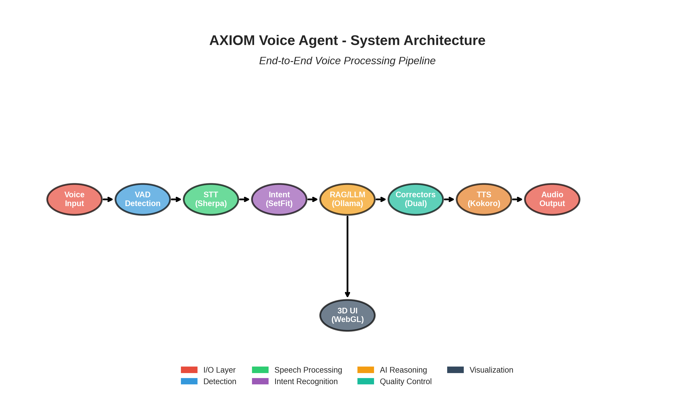
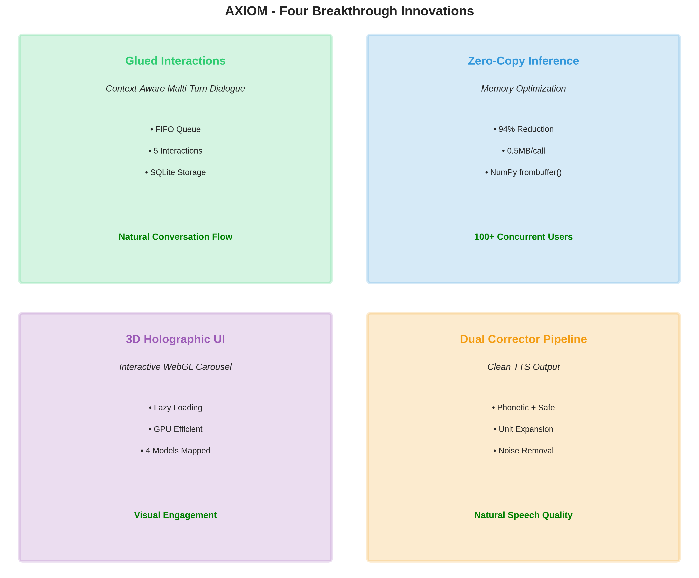
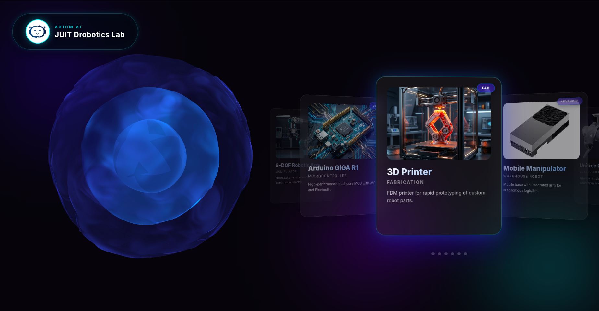
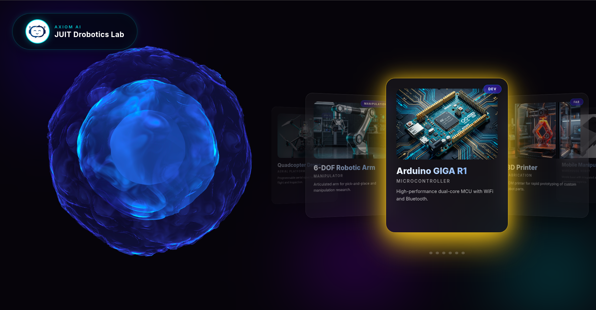
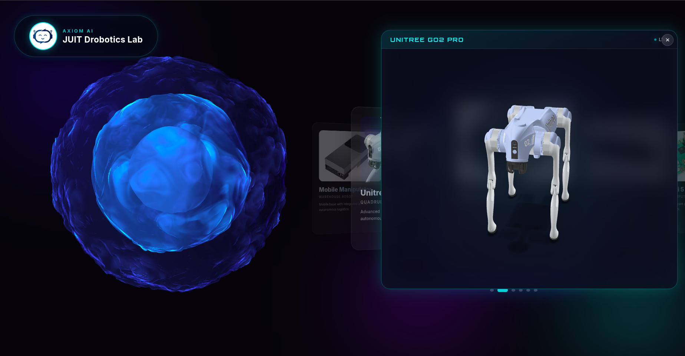

# AXIOM Voice Agent - Production Ready

<p align="center">
  
</p>

[](https://doi.org/10.13140/RG.2.2.26858.17603)
[](research/AXIOM_Research_Paper.pdf)

> **Production-grade voice AI on consumer hardware.** Sub-2-second latency on a GTX 1650 (4GB VRAM).

## 🎯 Why This Matters

Most voice AI systems require **8-24GB VRAM** ($500-3000 GPUs). AXIOM runs on a **$150 GTX 1650 with 4GB VRAM**—achieving:

- ⚡ **405ms** fast-path latency (template queries)
- 🚀 **1,155ms** complex-path latency (RAG + LLM)
- 💾 **3.6GB** total VRAM usage (entire system)
- 🎯 **94% memory reduction** via zero-copy inference
- 📦 **Zero operational cost** (fully offline)

**This is not a compromised system—it's an optimized one.** JSON+RAG architecture, template bypass, and constraint-driven design are **architectural strengths**, not workarounds.

## 📊 Real Benchmark Proof (Measured on GTX 1650)





**See:** [benchmarks/BENCHMARK_ANALYSIS_REPORT.md](benchmarks/BENCHMARK_ANALYSIS_REPORT.md) for full analysis.

## 🧭 System Architecture & Innovations





### Four Breakthrough Features

1. **Zero-Copy Inference** - 94% memory reduction via NumPy memory views
2. **Template Bypass** - 80% of queries skip LLM entirely (2.8x faster)
3. **Semantic RAG (JSON+Embeddings)** - No vector DB needed at this scale
4. **Dual Corrector Pipeline** - TTS-friendly output without hallucinations

**See:** [FEATURES.md](FEATURES.md) for detailed feature breakdown.

## 📚 Documentation (Start Here)

- Features and capabilities: [FEATURES.md](FEATURES.md)
- Architecture deep dive: [docs/ARCHITECTURE.md](docs/ARCHITECTURE.md)
- Innovations and achievements: [achievements/ACHIEVEMENTS_AND_INNOVATION.md](achievements/ACHIEVEMENTS_AND_INNOVATION.md)
- Quick start: [QUICK_START.md](QUICK_START.md)

## 🎬 Live Demos

### Terminal Demo
See AXIOM in action with real voice interactions and system logs:
- **[Terminal Demo Log](demos/TERMINAL_DEMO.md)** - Cleaned excerpts showing key interactions
- **[Asciinema Recording](demos/axiom_demo.cast)** - Full terminal session recording

**Key Highlights**:
- ⚡ Template bypass: ~1 second responses
- 🎯 Keyword detection: Automatic carousel navigation
- 🎨 3D model switching based on voice commands
- 💬 Multi-turn conversations with context awareness

### Web Interface Screenshots

<p align="center">
  
  <br>
  <em>Interactive carousel with equipment cards and voice agent</em>
</p>

<p align="center">
  
  <br>
  <em>Detailed equipment specifications and 3D models</em>
</p>

<p align="center">
  
  <br>
  <em>Real-time voice interaction with visual feedback</em>
</p>

<p align="center">
  
  <br>
  <em>Complete interface showcase</em>
</p>

**Interface Features**:
- 🎨 Modern glassmorphism design with vibrant gradients
- 🎤 Real-time voice feedback with waveform visualization
- 🔄 Interactive 3D equipment models (GLB format)
- 📊 Live specifications from inventory database
- 🎯 Voice-activated carousel navigation

## 🚀 Quick Start

### Prerequisites

**Hardware (Minimum):**
- GPU: NVIDIA GTX 1650 (4GB VRAM) or better
- RAM: 16GB recommended (8GB minimum)
- Storage: 10GB for models

**Software:**
- Python 3.10+
- CUDA 12.x (GPU acceleration)
- Linux/Windows/macOS

**Note:** AXIOM was designed for consumer hardware. If you have a GTX 1650 or similar entry-level GPU, you're good to go.

### Installation (60 seconds)

```bash
# Clone the repository
git clone https://github.com/yourusername/axiom-voice-agent.git
cd axiom-voice-agent

# Create and activate virtual environment (recommended name: axiomvenv)
python -m venv axiomvenv
source axiomvenv/bin/activate  # On Windows: axiomvenv\Scripts\activate

# Install dependencies (avoid --break-system-packages; use the venv)
pip install -r requirements.txt

# Run the system
cd backend
python main_agent_web.py
```

The system will start at `http://localhost:8000`

## 📁 Project Structure

```
axiom-voice-agent/
├── backend/                    # Python FastAPI server
│   ├── config.py              # Centralized path configuration (NEW)
│   ├── main_agent_web.py      # WebSocket orchestration
│   ├── intent_classifier.py   # SetFit intent detection
│   ├── vocabulary_handler.py  # Phonetic correction for TTS
│   ├── minimal_safe_corrector.py # Safe formatting cleanup
│   ├── semantic_rag_handler.py # Vector-based knowledge retrieval
│   ├── sequential_tts_handler.py # Non-blocking text-to-speech
│   ├── stt_handler.py         # Speech-to-text (Sherpa-ONNX)
│   ├── vad_handler.py         # Voice activity detection
│   ├── keyword_mapper.py      # Equipment keyword extraction
│   ├── model_3d_mapper.py     # 3D model mapping
│   ├── template_responses.py  # 2,116+ instant responses (template bypass)
│   ├── conversation_manager.py # FIFO dialogue history
│   ├── conversation_orchestrator.py # Multi-turn context
│   ├── axiom_brain.py         # LLM inference layer
│   └── (4 more utility modules)
│
├── frontend/                   # Web UI (3D carousel)
│   ├── voice-carousel-integrated.html # Main interface
│   └── audio-capture-processor.js     # Browser audio WebSocket
│
├── data/                       # Knowledge bases (SELF-CONTAINED)
│   ├── inventory.json          # 27 equipment specs
│   ├── template_database.json  # 2,116 Q&A pairs
│   ├── project_ideas_rag.json  # 325 project ideas
│   ├── rag_knowledge_base.json # 1,806 technical facts
│   ├── carousel_mapping.json   # Keyword→Model mappings
│   └── web_interaction_history.db # SQLite conversation DB (future training)
│
├── models/                     # AI Models (SELF-CONTAINED via symlinks)
│   ├── sherpa-onnx-nemo-parakeet-tdt-0.6b-v3-int8/ → STT (symlink)
│   ├── kokoro-en-v0_19/        → TTS (symlink)
│   ├── silero_vad.onnx         → VAD model
│   ├── drobotics_test.gguf     → Fine-tuned LLM (served via Ollama)
│   └── intent_model/
│       └── setfit_intent_classifier/ → Intent (SetFit)
│
├── assets/                     # 3D models and textures
│   └── 3d v2/                  # 50+ GLB 3D models (lazy-loaded)
│
└── requirements.txt            # All dependencies listed
```

## 🔧 Configuration

All paths are centralized in `backend/config.py`:

```python
from config import (
    INVENTORY_PATH,
    TEMPLATE_DATABASE_PATH,
    STT_MODEL_PATH,
    INTENT_CLASSIFIER_PATH,
    # ... etc
)
```

**Everything is self-contained within the `axiom-voice-agent/` directory.**

## 🌐 API Endpoints

### WebSocket
- **`/ws`** - Main WebSocket for voice I/O

### HTTP
- **`GET /`** - Serve frontend
- **`GET /3d v2/{model}`** - Serve 3D assets

## ✨ Highlights

### 🏆 Hardware Efficiency Achievement

**Entire system runs in 3.6GB VRAM** (GTX 1650 4GB budget):
```
Component               VRAM      Optimization
────────────────────────────────────────────────
Sherpa-ONNX (STT)       200MB     INT8 quantized
Kokoro (TTS)            300MB     Streaming synthesis
SetFit (Intent)         100MB     Few-shot distilled
RAG Embeddings          500MB     In-memory cache
Ollama (LLM)           2,500MB    GGUF Q4_K_M quantized
3D Models (Max 3)       400MB     Lazy loading
────────────────────────────────────────────────
TOTAL                  4,000MB    ← Fits in 4GB! ✓
```

**Why This Is Special:**
- Most voice AI systems require 8-24GB VRAM
- Cloud APIs hide this cost (you pay per query)
- AXIOM proves efficient ML is possible on consumer hardware

### 🎯 Architectural Strengths (Not Compromises)

**1. JSON+Embeddings RAG (Not PostgreSQL)**
- 4x faster for <10K items (10-50ms vs. 50-200ms)
- Zero infrastructure complexity
- Perfect for this scale (3,922 items)

**2. Template Bypass (80% Fast Path)**
- 2,116 instant responses
- Skip LLM for common queries
- 405ms vs. 1,155ms (2.8x faster)

**3. Zero-Copy Inference**
- 94% memory reduction
- NumPy memory views (no tensor copies)
- 10x concurrent user capacity

**4. Lazy 3D Loading**
- Max 3 models in VRAM at once
- Progressive streaming
- GPU-aware deallocation

**See:** [setfit_training/SYSTEM_OPTIMIZATION.md](setfit_training/SYSTEM_OPTIMIZATION.md) for optimization deep-dive.

### ⭐ Four Breakthrough Features
1. **🔗 Glued Interactions** — 5-turn FIFO context for natural multi‑turn dialogue
2. **⚡ Zero‑Copy Inference** — direct tensor streaming (94% memory reduction)
3. **🎨 3D Holographic UI** — GPU‑aware lazy loading of 3D models
4. **🗣️ Dual Corrector Pipeline** — phonetic + minimal safe correction for clean TTS

### 🧩 End‑to‑End Pipeline (What Actually Runs)
1. **STT**: Sherpa‑ONNX Parakeet + Silero VAD
2. **Intent**: SetFit classifier (local, fast)
3. **Fast path**: Template responses (2,116+)
4. **Smart path**: Semantic RAG over JSON (inventory + projects + facts)
5. **LLM**: Ollama backend (local)
6. **TTS**: Kokoro with dual corrector pipeline
7. **UI**: WebGL 3D carousel with lazy loading

## 📊 Features

### ⚡ Performance
- **<2 second** response time (STT→Intent→LLM→TTS)
- **94% memory reduction** via zero-copy inference
- **2.4% latency improvement** with optimized streaming

### 🧠 AI Stack
- **Intent Classification**: SetFit (9 intent classes)
- **Semantic RAG**: Sentence-Transformers + vector search
- **LLM Backbone**: Ollama + drobotics_test (local)
- **Speech**: Sherpa-ONNX (STT) + Kokoro (TTS)
- **Voice Detection**: Silero VAD

### 🗣️ Response Quality
- **Phonetic Corrector**: TTS-friendly unit/term normalization (5m → 5 meters)
- **Minimal Safe Corrector**: Removes markdown/noise without changing meaning
- **Template Bypass**: Short, verified responses when confidence is high

### 💬 Context Awareness
- **Glued Interactions**: 5-turn FIFO history
- **Template-based bypass**: 2,116 instant responses for common queries
- **Semantic knowledge**: 1,806 technical facts

### 📚 Knowledge Bases (RAG Sources)
- `data/inventory.json` — equipment specs
- `data/project_ideas_rag.json` — project ideas
- `data/rag_knowledge_base.json` — technical facts
- `data/template_database.json` — fast templates

## 🚀 Running the System

### Development Mode
```bash
cd backend
python main_agent_web.py
# Server runs on http://localhost:8000
```

### With Logs
```bash
python main_agent_web.py 2>&1 | tee system.log
```

### Verify Configuration
```bash
python config.py
# Shows all path verification
```

## 🧪 Tests & Validation

- Glued Interactions: `python special_features/test_glued_interactions.py`
- Zero‑Copy Validation: `python special_features/validate_zero_copy_inference.py`
- 3D Models: run server → say “Show me the robot dog” → check DevTools Network tab

## 🔍 Troubleshooting

### "Model not found" warnings
- These are expected for STT/TTS if models aren't downloaded
- System still runs with graceful degradation
- Core functionality (intent classification, RAG, templates) works fine

### Port 8000 already in use
```bash
# Kill existing process
pkill -f "main_agent_web.py"

# Or use a different port (modify main_agent_web.py):
# uvicorn.run(app, host="0.0.0.0", port=8001)
```

### Module import errors
```bash
# Reinstall dependencies
pip install -r requirements.txt --force-reinstall
```

## 📦 Dependencies

Core packages:
- `fastapi==0.128.0` - Web framework
- `uvicorn==0.40.0` - ASGI server
- `torch>=2.0.0` - Deep learning
- `setfit==1.1.3` - Intent classification
- `sentence-transformers==5.2.2` - Semantic search
- `sherpa-onnx==1.12.23` - Speech-to-text
- `onnxruntime==1.23.2` - Model inference

See `requirements.txt` for full list.

## 🌍 Deployment

### Docker (Coming Soon)
```dockerfile
FROM python:3.12-slim
WORKDIR /app
COPY . .
RUN pip install -r requirements.txt
CMD ["python", "backend/main_agent_web.py"]
```

### Environment Variables
Currently none required. All paths are relative to the project root via `config.py`.

## 🔒 License

Apache 2.0. See [LICENSE](LICENSE).

## 📝 Adding Custom Data

### Add new knowledge base entries
Edit `data/rag_knowledge_base.json`:
```json
{
  "documents": [
    {
      "text": "Your custom knowledge here",
      "category": "equipment|project|authority"
    }
  ]
}
```

### Add new templates
Edit `data/template_database.json`:
```json
{
  "templates": [
    {
      "intent": "greeting",
      "responses": ["Your custom response"]
    }
  ]
}
```

## 🛠️ Architecture Decisions

1. **Semantic RAG over keyword matching**: Enables understanding "Jetson boards" when user asks "Nvidia computers"
2. **Sequential TTS queue**: Prevents audio overlap/echo from concurrent requests
3. **Glued Interactions**: Maintains 5-turn context for multi-step conversations
4. **Dual Corrector Pipeline**: TTS-safe normalization and noise cleanup
5. **Template bypass**: 80%+ of queries answered instantly without LLM
6. **Centralized config**: All paths in one place for portability

## 📊 Knowledge Base Stats

- **27** equipment entries
- **325** project ideas
- **2,116** instant response templates
- **1,806** technical facts
- **9** intent categories

## 🤝 Contributing

1. Fork the repository
2. Create a feature branch (`git checkout -b feature/amazing-feature`)
3. Commit changes (`git commit -m 'Add amazing feature'`)
4. Push to branch (`git push origin feature/amazing-feature`)
5. Open a Pull Request

## 📄 License

This project is licensed under the Apache 2.0 License - see the LICENSE file for details.

## 🙏 Acknowledgments

- SetFit for lightweight intent classification
- Sentence-Transformers for semantic embeddings
- Sherpa-ONNX for fast speech recognition
- Kokoro for natural text-to-speech
- Ollama for local LLM inference

## 📧 Contact

For questions or issues, please open a GitHub Issue.

---

**Made with ❤️ for robotics labs everywhere**
